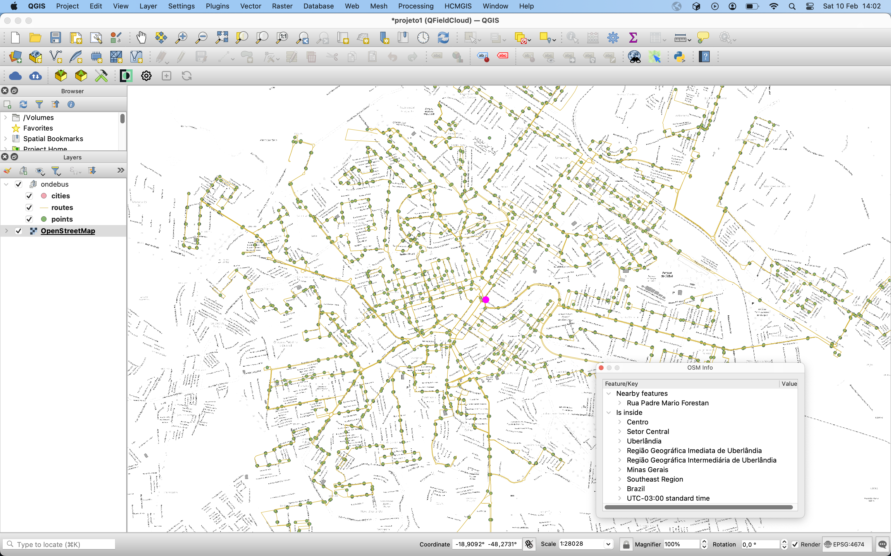

O OndeBus nasceu depois. Antes dele, existiu o **UdiBus**.

E antes do UdiBus existir como “projeto”, ele existia como uma dúvida chata que aparece do nada e não vai embora:

> “Quais linhas passam nesse ponto aqui?”

## UdiBus (quando eu estava em Uberlândia)

No final de março daquele ano eu tinha começado a trabalhar como programador PHP em uma empresa de sites.

Todo dia era o mesmo ritual: pegar um ônibus até o Terminal Central, depois outro até o trabalho. Uns **40 minutos** em média.

Até que, alguns dias depois, eu descobri que se eu pegasse o ônibus em um ponto mais longe (uns **10 minutos a pé** a mais), eu chegava muito mais rápido.

Fiz o teste. Deu certo.

O trajeto caiu para uns **20 minutos**, os ônibus vinham mais vazios e eu ainda ganhava tempo pra ler mais um pouco (na época eu estava lendo TDD e me achando muito disciplinado 😄).

Nascia a ideia…

No caminho até esse ponto “novo”, eu passava por vários outros pontos e sempre batia a mesma dúvida: **quais linhas passam aqui?** Eu não tinha a menor noção.

E por mais bobo que pareça, aquilo começou a me incomodar de verdade.

## A primeira tentativa (e o primeiro “não dá”)

No emprego novo ainda não tinham me passado trabalho direito, então eu fui pesquisar API de mapas.

A primeira coisa que eu olhei foi Google Maps, mas rapidamente percebi que não era aquilo que eu precisava (pelo menos não do jeito que eu tinha imaginado).

Aí veio o segundo “ahá”: eu esbarrei no **OpenLayers**, consegui desenhar coisas no mapa e pensei: “ok… dá pra fazer”.

Cheguei em casa e comecei a rabiscar a ideia com mais carinho.

Depois de um mês na empresa e uma experiência ruim, eu decidi sair e trabalhar só no projeto.

Sim, isso foi meio doido. (Mas foi divertido.)

## Stack da época: o “feijão com arroz” geoespacial

Eu tinha feito recentemente um curso básico de **CakePHP**, então foi ele.

Banco: **PostgreSQL + PostGIS** (pra salvar pontos e linhas).  
Mapa: **OpenLayers**.  
Layout: **Twitter Bootstrap**.

Nesse meio tempo eu aprendi muito JavaScript. Antes eu vivia no “jQuery básico” e achava que dominava o mundo.

Aí fui brincar com templates, organização de código e até usei **HandlebarsJS**.

[Um dia eu chego nos frameworks JS. Um dia… 😄]

## Versão 2: reescreve tudo, agora vai

Quando eu decidi que ia levar o UdiBus a sério, eu também revisei e reescrevi tudo seguindo as convenções do CakePHP.

A ambição da versão 2 era ousada: **mostrar o local exato dos ônibus no mapa**.

Na época eu tinha lido que os ônibus tinham GPS há muito tempo… mas tem um detalhe pequeno e inconveniente: eu não tinha (e não tenho) acesso ao feed de localização.

Ou seja: é possível… **quando você tem o dado**.

## O trabalho chato: desenhar rotas e pontos

Do tempo total de desenvolvimento do UdiBus, uma parte enorme não foi “programar”.

Foi **popular o mapa**.

Desenhar rotas e cadastrar pontos era, sem exagero:

- chato  
- difícil  
- demorado  

O tamanho médio de uma rota ficava por volta de **18 km** e, com vários pontos no caminho, levava fácil **1 hora** pra cadastrar uma única linha (isso se você não abrisse nenhuma aba do navegador “só pra respirar”, o que é impossível).

E tinha a parte mais ingrata: **decifrar o mapa**.

Muitas vezes eu dependia de um PDF de referência com nomes de ruas, porque nem sempre dava pra ler direito no mapa base.

Teve uma semana específica que eu fiquei tão tempo nisso que parecia que eu estava vendo rostos nas rotas. @_@

Então eu parei de cadastrar e voltei a programar.

A meta era simples: diminuir sofrimento.

- ferramenta pra **editar rota** em vez de refazer  
- fluxo pra **corrigir trechos**  
- detalhes pra agilizar o cadastro

[Ahá! Agora dá pra editar as rotas em vez de refazê-las! :D]

## Mobile (que quase foi) e o “responsivo” que aconteceu

No começo eu pensei em fazer uma versão exclusivamente mobile (na época, cogitei jQuery Mobile), mas eu só faria isso depois de terminar o painel administrativo.

E o painel virou um buraco sem fundo.

Como eu já estava usando Bootstrap, o projeto acabou indo naturalmente pro lado do **design responsivo**.

Isso aumentou a complexidade porque a mesma página precisava funcionar em telas e conexões diferentes (e em 3G… que era uma experiência espiritual).

E sim: teve a parte de “err… desculpa Internet Explorer”. 😅

## De Uberlândia para Porto Velho: OndeBus

Em algum momento eu tive que voltar para **Porto Velho**.

E aí o nome “UdiBus” ficou preso no lugar: Uberlândia.

Eu queria manter a ideia, mas agora a proposta fazia mais sentido como algo que poderia atender **várias cidades**, não só uma. Foi aí que o projeto virou **OndeBus**.

Junto com isso, veio uma mudança importante: eu comecei a usar **Laravel** (lá pela versão 4).

O UdiBus nasceu em CakePHP.  
O OndeBus já nasceu com outra mentalidade.

Mais organizado, mais “produtizável”, com espaço pra crescer… pelo menos na teoria.

## Versões, recomeços e a natureza geoespacial

Nesse meio tempo eu cheguei a fazer uma **quinta versão**, mas descontinuei.

Também teve o momento em que eu não renovei mais o domínio.

Mesmo assim, esse é um projeto que eu sempre gostei de fazer — não só pela utilidade, mas pela natureza **geoespacial** dele:

- lidar com **linhas e pontos**  
- pensar em **camadas**  
- montar um “mundo” em cima de mapa  
- e tentar transformar “um caos urbano” em algo legível

OndeBus é daqueles projetos que ficam em algum canto da cabeça.

Talvez ele não esteja “no ar” hoje, mas ele ainda existe como uma ideia boa.

E eu ainda acho que um dia eu volto nele. :)
