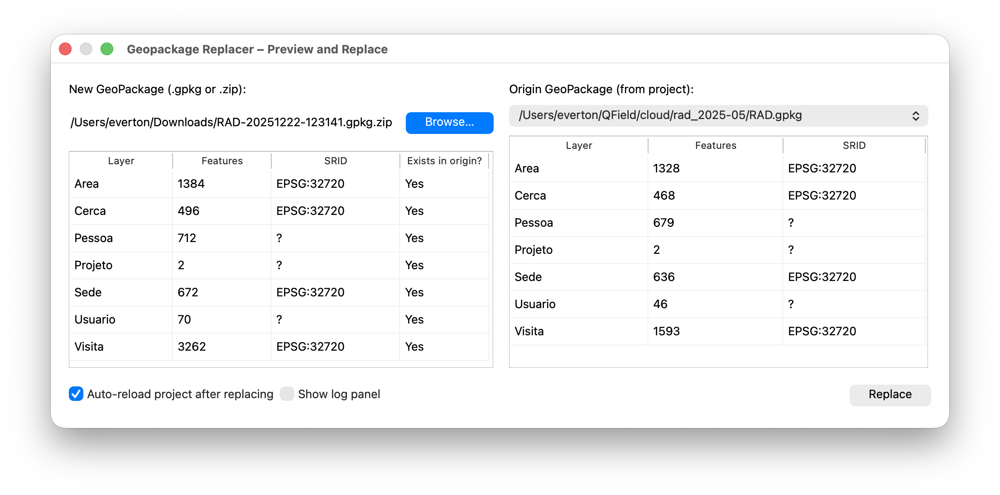

Em um projeto utilizando a ferramenta
<a href="https://qgis.org/" target="_blank">QGIS</a>, eu precisava com uma certa frequência trocar vários GeoPackages.

O fluxo padrão era necessário fechar o projeto, trocar o arquivo e reabrir o QGIS.

O **Geopackage Replacer** elimina esse atrito: você escolhe o novo arquivo (ou `.zip`) e o plugin cuida da troca.

<!--more-->

## Como funciona

- Selecione o **GeoPackage atual** que o projeto está usando.
- Escolha o **novo arquivo** (`.gpkg` ou `.zip` com um `.gpkg` dentro).
- O plugin realiza a **substituição** do arquivo referenciado no projeto, reduzindo a necessidade de reiniciar o QGIS.
- Logs informam o andamento e o resultado da troca.

## Instalação

Você pode instalar pelo **Gerenciador de Plugins do QGIS** (Install from ZIP) com o pacote do repositório, ou clonar o código‑fonte para a pasta de plugins do seu perfil.

- Repositório: https://github.com/hewerthomn/geopackage-replacer-qgis-plugin
- Página do plugin: https://plugins.qgis.org/plugins/geopackage_replacer/

## Passo a passo (uso)

1. Abra o projeto no QGIS.
2. Vá em **Plugins → Geopackage Replacer → Open Geopackage Replacer…**
3. Em **Novo arquivo**, selecione o `.gpkg` (ou o `.zip`).
4. Em **Origem**, escolha o GeoPackage atualmente usado no projeto.
5. Clique em **Replace** e aguarde a confirmação.

## Notas
- Ao fornecer um **.zip**, o plugin utiliza o **primeiro `.gpkg`** encontrado dentro do arquivo.
- Em GeoPackages **grandes**, a leitura pode levar alguns segundos.

## Links
- Código e issues: https://github.com/hewerthomn/geopackage-replacer-qgis-plugin
- Página no repositório de plugins do QGIS: https://plugins.qgis.org/plugins/geopackage_replacer/

---