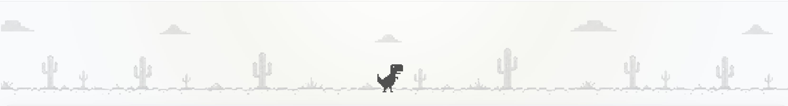

Um dia desses a internet caiu.

Não foi aquela queda dramática de ficar reiniciando roteador, olhando para as luzes do modem e tentando descobrir se o problema era comigo, com a operadora ou com algum alinhamento estranho dos planetas. Foi só uma queda simples, dessas que interrompem o que você estava fazendo e fazem o navegador mostrar novamente aquele velho conhecido: o dinossauro do Chrome.

E lá estava ele.

Parado no deserto, esperando alguém apertar espaço para começar a correr.

<!--more-->

Acho curioso como um jogo tão simples consegue ser tão reconhecível. Não tem menu complicado, não tem tutorial, não tem login, não tem inventário, não tem upgrade, não tem nada. Só um dinossauro, alguns cactos e aquela vontade de bater o próprio recorde.

Mas dessa vez, olhando para ele, pensei:

E se fosse de outro jeito?

Não exatamente de lado, como o original. E se o dino estivesse correndo numa pistas, numa perspectiva diferente,
quase como aqueles joguinhos endless runner?

Foi daí que nasceu o **Dino Lane**.

Como eu estava estudando e brincando com a **Godot**, resolvi transformar a ideia em um projetinho jogável.

E como quase todo projetinho simples, ele começou pequeno.

Primeiro era só o dino se mexendo.

Depois vieram os obstáculos.

Depois a pontuação.

Depois aquela vontade perigosa de “só adicionar mais uma coisinha”.

E quando vi, já tinha tela inicial, game over, música, efeitos, arte pixelada, ranking global e uma página de leaderboard com os melhores jogadores.

Dino Lane virou um daqueles projetos que começam como uma brincadeira de fim de semana e acabam ganhando vida própria.

## Feito em Godot

O jogo foi desenvolvido em **Godot**, uma engine que eu já vinha querendo usar mais em projetos pequenos.

A parte legal é que ela permite iterar rápido. Você mexe em uma cena, ajusta um script, testa, quebra alguma coisa, arruma, quebra outra, e quando percebe já passou mais tempo do que deveria tentando melhorar um detalhe que talvez só você vá notar.

Mas é justamente essa parte que deixa o projeto divertido.

A proposta do Dino Lane não era criar um jogo complexo. Era fazer algo simples, direto e com cara de jogo de navegador: abriu, clicou, jogou.

Nada de instalação.

Nada de configuração.

Só jogar e tentar ir mais longe.

## Ranking global

Uma coisa que achei divertida foi adicionar um ranking global.

Porque jogar sozinho tentando bater o próprio recorde já é legal, mas ver o nome de outras pessoas no topo muda completamente a brincadeira.

Agora o jogo tem uma lista com os melhores jogadores, pontuação, data da jogada e país. Então além de correr dos cactos, também tem aquela pressão psicológica de tentar aparecer no Top 100.

E claro, como todo ranking, ele também serve para passar raiva quando você morre logo depois de fazer uma pontuação boa.

## Jogue

O jogo está disponível aqui: [Dino Lane](https://dino.hewerthomn.com/game)

No fim, Dino Lane é isso: uma pequena homenagem ao dinossauro do Chrome, mas visto por outro ângulo.

Literalmente.
