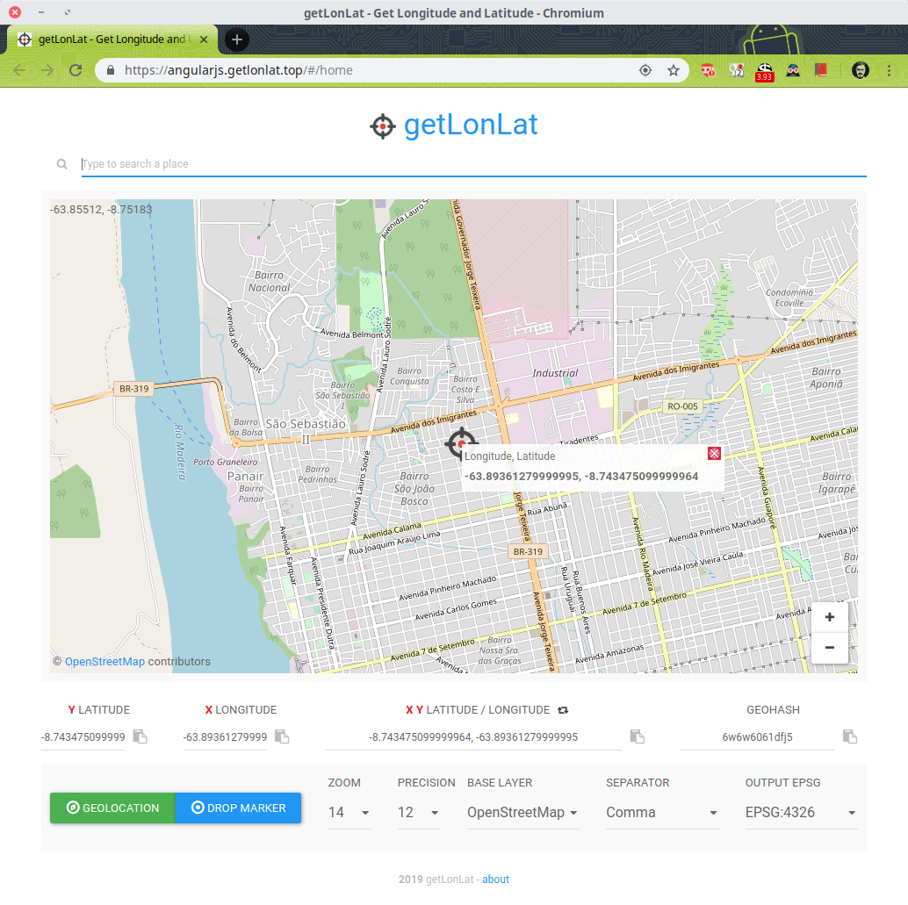
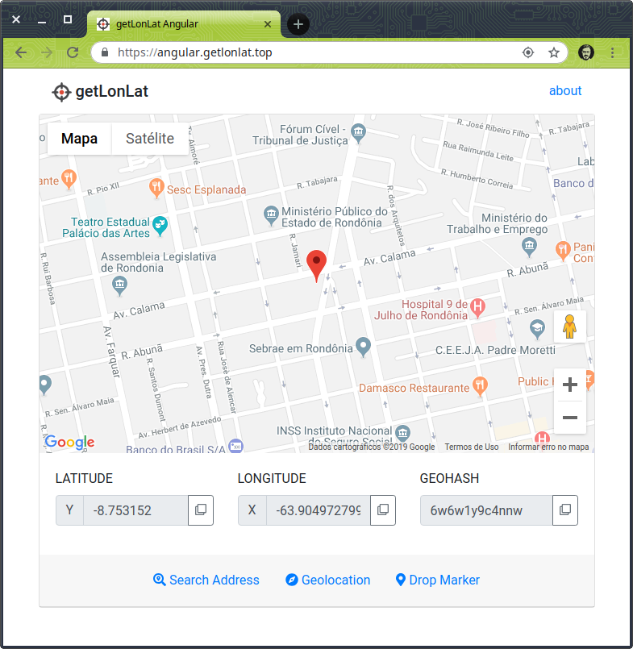
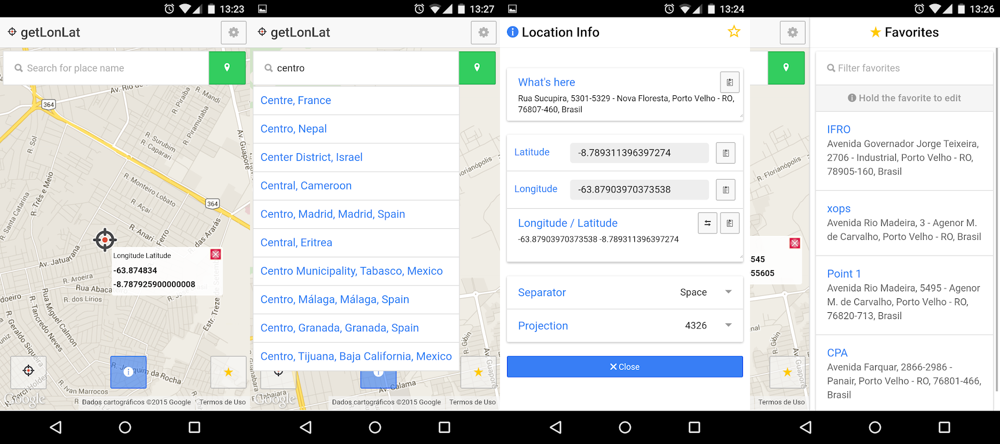
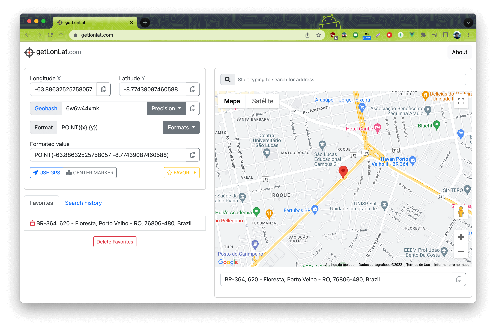

Durante o desenvolvimento de aplicações que utilizam dados espaciais, é necessário utilizar coordenadas válidas.
Ou seja, além dos valores de longitude estar dentro da faixa de -180 a 180 graus e -90 e 90 graus para latitude,
pode ser desejável que a localização esteja relacionada ao contexto aplicado, assim não podendo ser qualquer localização.

Nesse contexto que surgiu minha necessidade.

Na época eu estava trabalhando no projeto UdiBUs e quando precisava inserir coordenadas para poder testar os registros de pontos ou rotas das linhas, 
sempre era demorado e complicado copiar cada valor das coordenadas e depois colar nos respectivos destinos.
E isso sempre me causava confusão pois Longitude é o eixo X e Latitude o eixo Y e muitas vezes acabava confundindo e trocando os valores ao inserir,
o que causava perca de tempo e frustação até descobrir que a coordenada que estava invertida...

**getLonLat** é um aplicativo web que fornece as coordenadas formatadas para facilitar sua utilização em diferentes contextos.
Basta clicar no mapa ou pesquisar por um endereço ou até mesmo usar a geolocalização do seu dispositivo.

Exemplos dos formatos e suas respectivas saídas:
| Formato | Saída                                               |
|---------|-----------------------------------------------------|
| PostGIS | POINT(-63.886829726367196 -8.769162628273588)       |
| Object  | Point(-63.886829726367196, -8.769162628273588)      |
| Array   | [-63.886829726367196, -8.769162628273588]           |
| Json    | {"x": -63.886829726367196, "y": -8.769162628273588} |

Dada essa natureza simples do app, o getLonLat acabou tornando-se o meu "ToDo App",
que é o tipo de aplicativo simples que geralmente implementamos quando estamos aprendendo alguma ferramenta pra criar apps web,
vide [TodoMVC](https://todomvc.com/).

### getLonLat v1

A primeira versão foi desenvolvida utilizando o *finado* framework [AngularJS](https://angularjs.org/) e
utilizava a biblioteca de maps OpenLayers e como mapa base o OpenStreetMap, Google Maps e até o Bing Maps :joy:.

### getLonLat v2

Também teve uma versão quando saiu o sucessor espiritural do AngularJS, o [Angular 2](https://angular.io/).
Essa versão era simplificava e contava apenas com o mapa base do Google Maps.

### getLonLat Mobile

Com o Angular 2, também saiu uma nova versão do [Framework Ionic](https://ionicframework.com/) para desenvolvimento de apps híbrido.
Assim você desenvolvia no navegador e depois executava como um app mobile, funcionava para alguns casos.
E é claro que eu iria testar justamente com o getLonLat, né :smile:

### getLonLat v3

E finalmente a versão atual. Desenvolvida utilizando [VueJS](https://vuejs.org/), meu framework preferido para SPA,
e utilizando, finalmente, a biblioteca de maps [Leaflet](https://leafletjs.com/) com mapa base do Google Maps (mas pretendendo alterar para o [OpenStreetMap](https://www.openstreetmap.org/)).

Acesse o https://getlonlat.com
