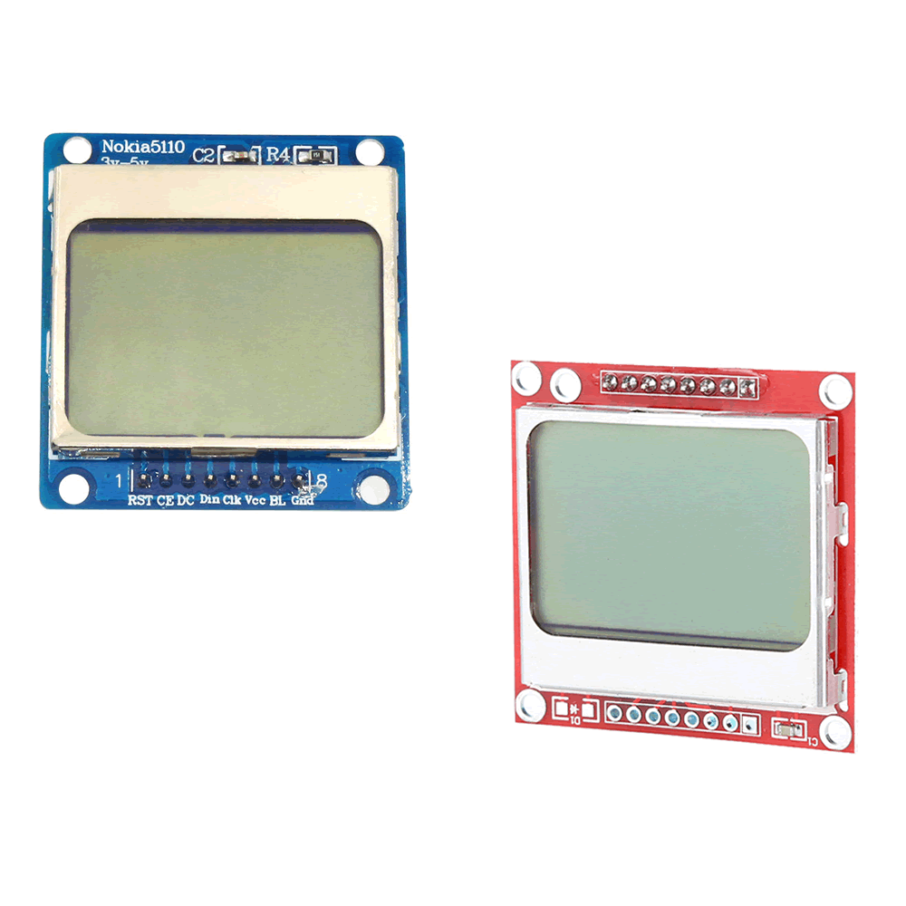
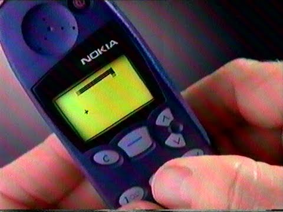

Inspirado no clássico jogo da cobrinha dos antigos celulares Nokia,
esse foi um dos projetos que mais me diverti fazendo.

Quando comecei a estudar Arduino, um dos componentes que comprei foi o Display LCD do Nokia 5110, aquele Nokia tijolão mesmo.

Então fui atrás de fazer o jogo da cobrinha para o Arduino.