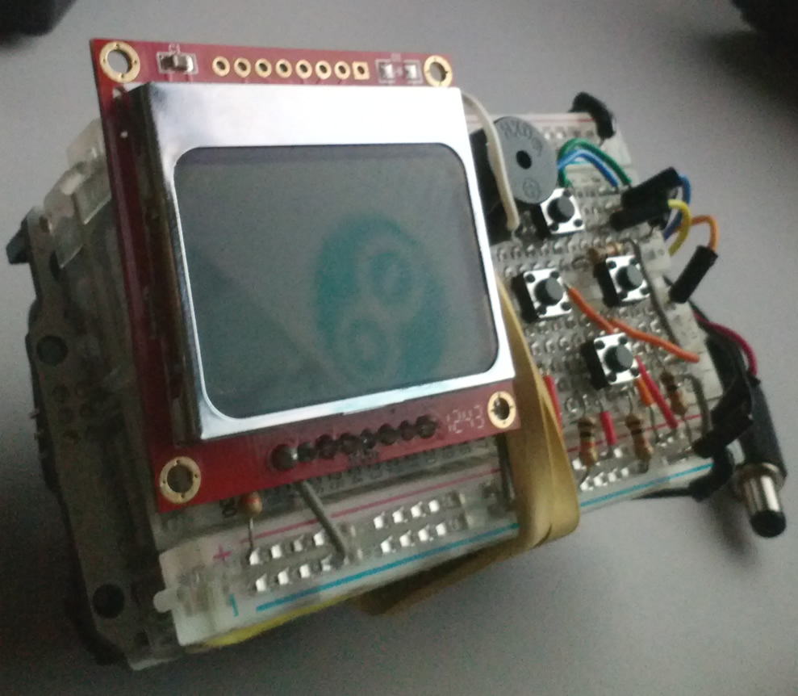
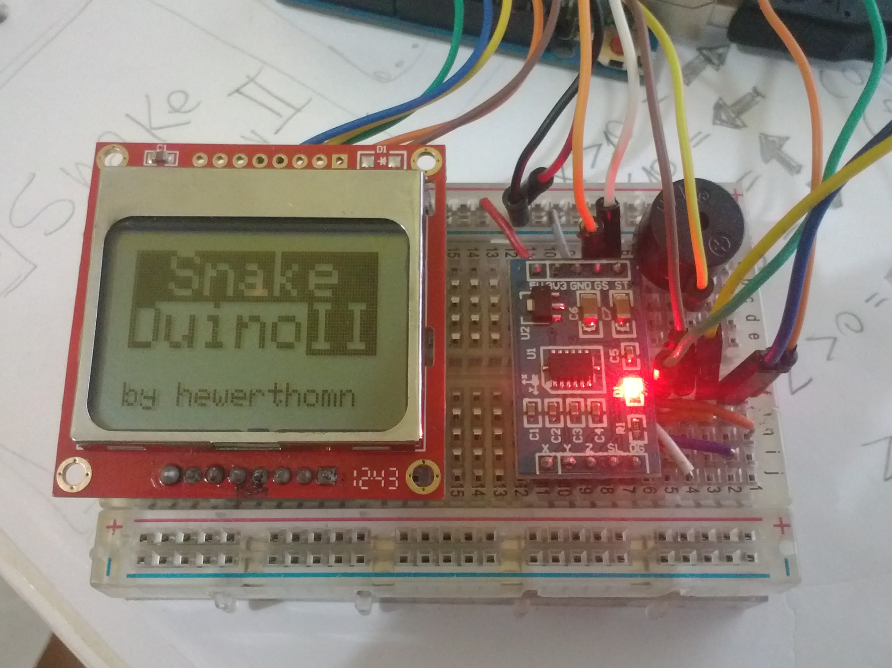
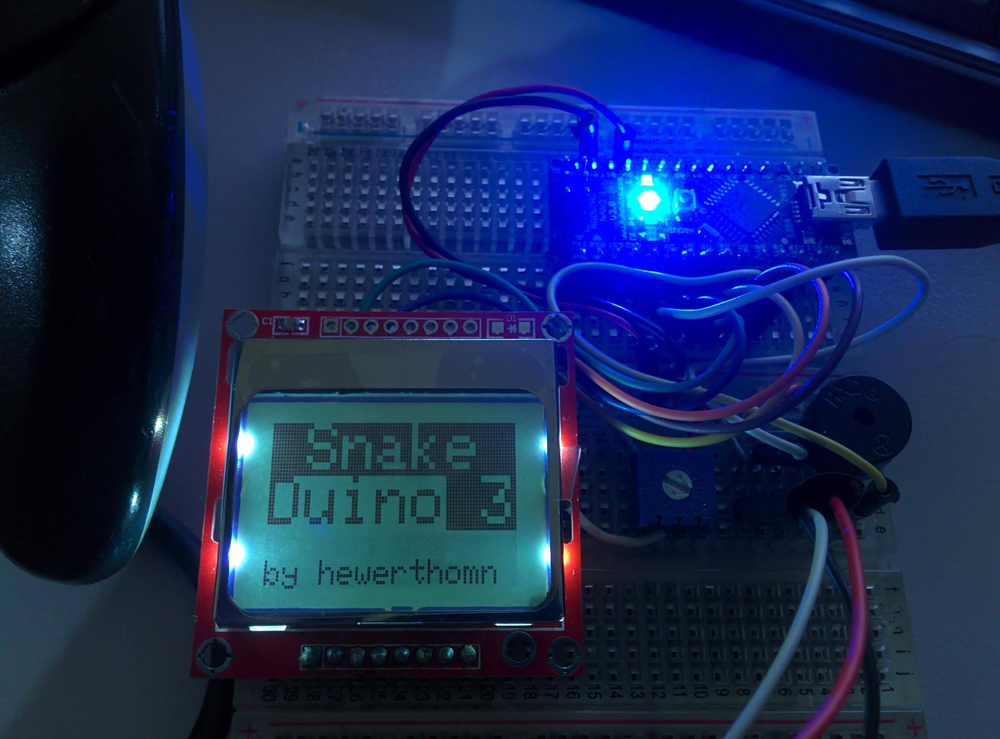

Quando comecei a estudar Arduino em meados de 2012, um dos componentes que comprei foi o Display LCD do Nokia 5110.
Isso mesmo, daqueles Nokia tijolão. :smile:

Então fui atrás do jogo da cobrinha para o Arduino e esse foi um dos projetos mais divertidos de se fazer.

<!--more-->

## Snake Duino v1

Os componentes de botões que eu tinha disponível na primeira versão do projeto eram do tipo SMD,
era difícil de controlar a cobrinha com agilidade naqueles botões meio duros.

[Repositório do código](https://github.com/hewerthomn/snake-duino-v1)

  <iframe src="https://player.vimeo.com/video/80229003?badge=0&amp;autopause=0&amp;player_id=0&amp;app_id=58479" frameborder="0" allow="autoplay; fullscreen; picture-in-picture; clipboard-write" style="position:absolute;top:0;left:0;width:100%;height:100%;" title="Snake Duino v1">
  </iframe>

## Snake Duino v2

Tentando substituir os botões duros, usei um sensor de movimento que eu tinha disponível,
um acelerômetro MMA7361.

Até que deu de jogar. A diferença é que antes de jogar precisa calibrar o sensor em uma superfície plana.

[Repositório do código](https://github.com/hewerthomn/snake-duino-II) 

<iframe src="https://player.vimeo.com/video/80697779?badge=0&amp;autopause=0&amp;player_id=0&amp;app_id=58479" frameborder="0" allow="autoplay; fullscreen; picture-in-picture; clipboard-write" style="position:absolute;top:0;left:0;width:100%;height:100%;" title="Snake Duino II"></iframe>

## Snake Duino v3

Aqui usei um controle de Nintendo 64 que tinha disponível (Thanks xamps Sanderson pelo controle).

E apesar de não usar todos botões do controle, apenas o direcional e o start para iniciar, 
esse é de longe o melhor controle das quatro versões.

Uma vantagem deste controle também em relação aos anteriores é que ele usa apenas um pino do arduino
contra 4 pinos dos push buttons, 5 pinos do eixo duplo e 6 pinos do acelerômetro.

<iframe src="https://player.vimeo.com/video/80725135?badge=0&amp;autopause=0&amp;player_id=0&amp;app_id=58479" frameborder="0" allow="autoplay; fullscreen; picture-in-picture; clipboard-write" style="position:absolute;top:0;left:0;width:100%;height:100%;" title="Snake Duino III"></iframe>

## Snake Duino v4

Mal lembrei desse, mas aqui não uso a placa Arduino e sim a ESP32.
Adaptei o código para usar o joystick de dois eixos KY-023 e 
exibir a pontuação em tempo real no display de 4 dígitos TM1637.

<iframe src="https://player.vimeo.com/video/930832983?badge=0&amp;autopause=0&amp;player_id=0&amp;app_id=58479" frameborder="0" allow="autoplay; fullscreen; picture-in-picture; clipboard-write" style="position:absolute;top:0;left:0;width:100%;height:100%;" title="Snake Duino V4"></iframe>

## Próxima versão

O que eu gostaria de fazer futuramente é uma placa de circuito impresso, mesmo que o Arduino ainda fosse direto nela. 
Talvez até modelar um *case* e imprimir na impressora 3D e quem sabe uma bateria externa.

Quem sabe um dia... Demorou só 10 anos entre a versão 3 e 4. :joy:

