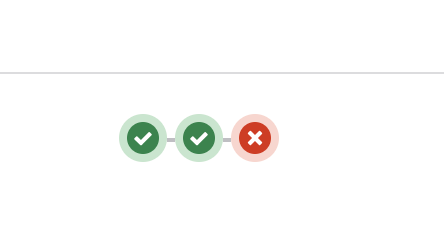
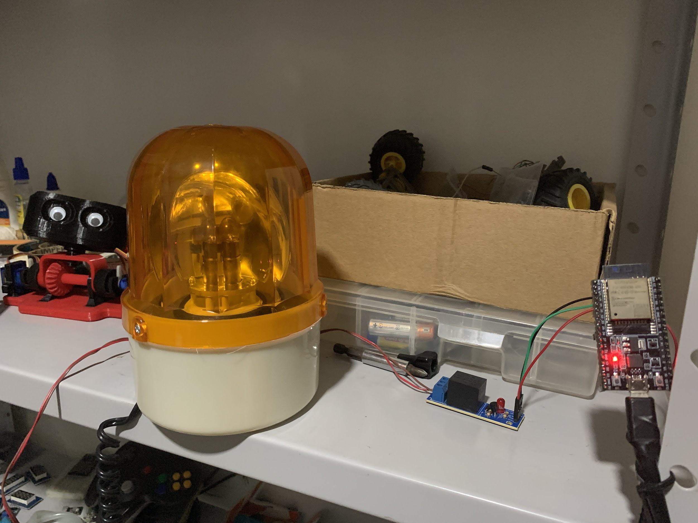

Em Desenvolvimento de Software, [Integração Contínua](https://pt.wikipedia.org/wiki/Integra%C3%A7%C3%A3o_cont%C3%ADnua)
é uma forma de executar tarefas sobre as alterações submetidas a um repositório de código.
Nessas tarefas pode-se executar variados tipos de testes, ferramentas de análise estática de código,
como verificação de sintaxe, estilos e também podendo executar tarefas para atualizar a aplicação para uma nova versão de forma automatizada.

E essa execução pode falhar quando um teste não passar ou a verificação de sintaxe ou estilo não estiver de acordo as regras definidas, 
de acordo como foi configurado.

<!--more-->

Inicialmente pensei em fazer a integração usando um semáforo do tipo Verde/Vermelho e quando a execução finalizasse sem erros, acenderia a luz verde e quando falhasse acenderia a luz vermelha.
Mas acabei comprando um Giroflex, parecido com aquelas sirenes que tem em cima de carros de segurança em vez
do semáforo, que estava bem caro na época que pesquisei.

Criei um [Webhook](https://pt.wikipedia.org/wiki/Webhook) no GitLab que envia as atualizações de um repositório de código
para uma aplicação PHP Symfony.

A aplicação processa o conteúdo do Webhook e verifica se a execução do *pipeline* falhou.
Caso tenha falhado, a aplicação escreve em um tópico MQTT. 
A placa ESP32 conectada no WiFi e com acesso à internet, se inscreve ao mesmo tópico MQTT que a aplicação
e liga o Giroflex quando recebe um valor esperado.

<iframe src="https://player.vimeo.com/video/936038117?badge=0&amp;autopause=0&amp;player_id=0&amp;app_id=58479" frameborder="0" allow="autoplay; fullscreen; picture-in-picture; clipboard-write" style="width:100%;height:680px;" title="GitLab Pipeline Monitor"></iframe>

Quando fiz isso parecia uma boa ideia mas na primeira vez que executou levei um baita susto.

No dia eu estava trabalhando *home office* e estava tudo bem silencioso, eu estava destraído e mal lembrava que tinha configurado a coisa.

Quando a sirene ligou, além de piscar tudo laranja eu não sabia de onde vinha o barulho. Foi assustador.

Depois desse dia eu desmontei o projeto, né. Até porque era mais fácil dar um gatilho de ansiedade do que ser útil.
Essa ideia se provou péssima e agora tô procurando uma utilidade para esse Giroflex. :joy:

