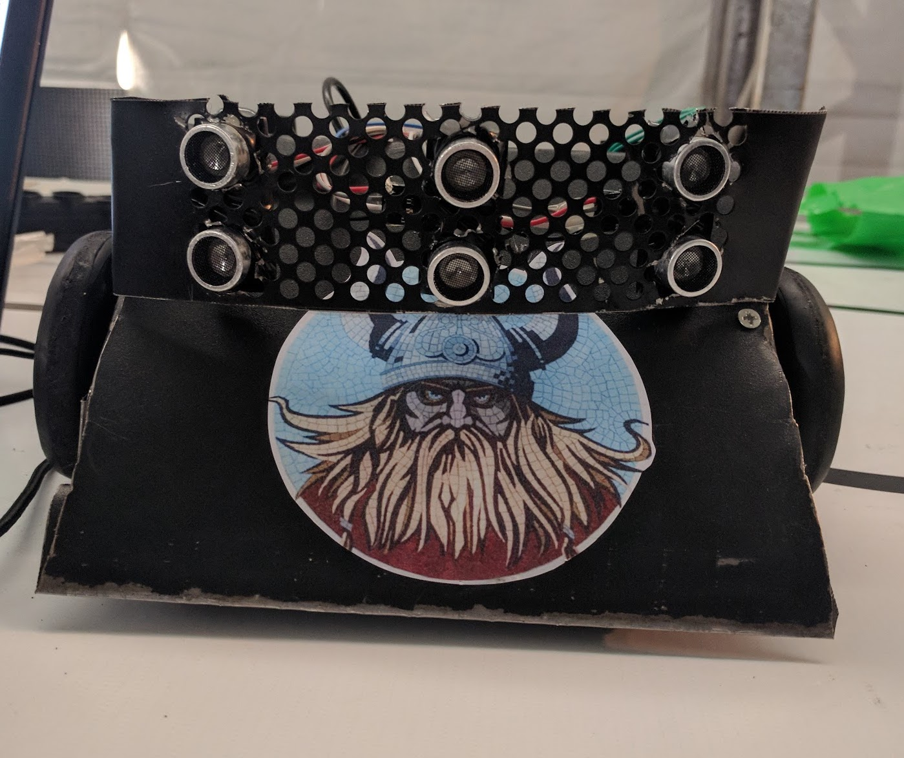
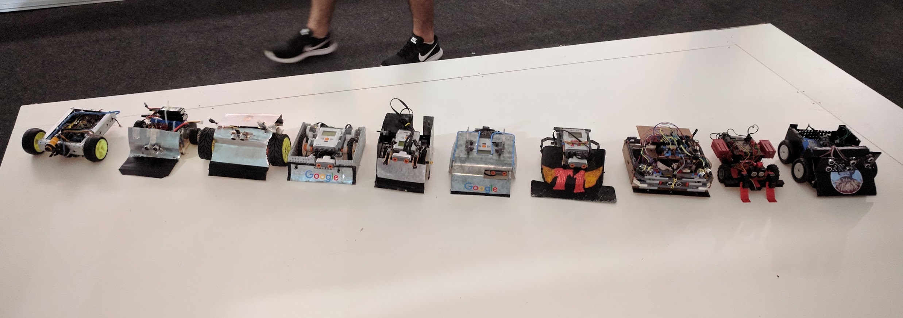
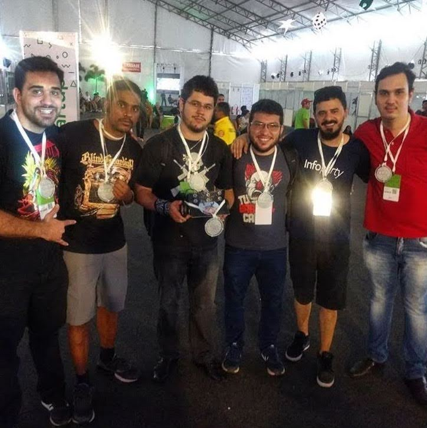

Em meados de 2016, o Governo de Rondônia realizou o evento InfoParty 2016 na cidade de Porto Velho.
O evento inspirado na Campus Party teve duas edições e contava com palestras, 
estandes de empresas de tecnologia e, a melhor parte, competições de robótica.

### I Beradeiro Robot Challenge

Na primeira edição, me inscrevi para participar na competição de Robô seguidor de linha.
Nessa competição que tinha três etapas, o robô deveria fazer um percurso de forma automatizada 
com seus sensores de linha, fazer uma curva quando tivesse um marcador colorido e na última etapa,
pegar uma bola e colocar em uma superfície.

<!--more-->

No meu kit de robótica havia apenas o sensor de linha preto, ou seja, só poderia competir pela primeira etapa.

As competições de robótica aconteceriam no segundo dia do evento, então viramos a madrugada
programando e fazendo testes dos robôs. A Marina Lans, que era da minha equipe, estava fazendo
o seu robô sumô FugINO com kit de robótica da Fischertechnik, que é muito parecido com uma Lego da Alemanha, muito bom por sinal.

Durante um teste, o robô sumô da Marina ao tentar empurrar meu robô, não se moveu.

Então, eu que já estava meio desanimado por não ter os componentes de sensor de linha colorido e braço pra
pegar bolinha, mudei o meu projeto para transformá-lo em um robô sumô também.
Formei uma nova equipe com amigos que apareceram no laboratório na madrugada, e assim nascia a equipe DestruINO. 

Teve até uma gambiarra para usar um PowerBank como fonte de energia porque apenas as pilhas
não estavam dando conta. :robot:

A competição de robô sumô era muito mais emocionante e quando começou rapidamente aglomerou 
pessoas e de repente tinha até torcida dos robôs. :joy:

<iframe width="560" height="315" src="https://www.youtube.com/embed/EIfrBcwUcYA?si=1I5f2za6cMkndWdQ" title="YouTube video player" frameborder="0" allow="accelerometer; autoplay; clipboard-write; encrypted-media; gyroscope; picture-in-picture; web-share" referrerpolicy="strict-origin-when-cross-origin" allowfullscreen></iframe>

O robô da Marina bateu em todo mundo. :joy: E provando o ponto de que o kit de robótica da Fishertechnik 
seria uma boa alternativa e com preço acessível, comparado com o kit da Lego, que ficou em terceiro lugar.

E em segundo lugar, kit Arduino da Robocore, equipe Destruino. :smile:

A medalha de primeiro lugar foi a Marina que me deu, mas essa de terceiro
lugar não lembro de onde veio. :joy:

### II Beradeiro Robot Challenge

 No ano seguinte, na InfoParty II, me juntei com o mesmos amigos do ano passado e criamos a equipe Vikings e o nosso robô sumô Beowulf. :D
 Nos reunimos bem próximo à data do evento, quase que não conseguíamos terminar o robô a tempo.

Esse ano teve mais robôs Arduino, seguido pelos Mindstorms da Lego e só um 
Fishertechnik da Marina.

Dessa vez demos sorte mas nem tanto e levamos (novamente) o segundo lugar.
O garotinho do kit Lego que tinha ficado em terceiro lugar no ano passado,
largou o kit Lego dele e veio com sangue nos olhos com um robô Arduino assassino (o terceiro da direita para esquerda) :exploding_head:

Equipe Vikings e o Renan que apareceu alí na hora e ainda ganhou medalha. :joy:

{{ template "_internal/disqus.html" . }}
