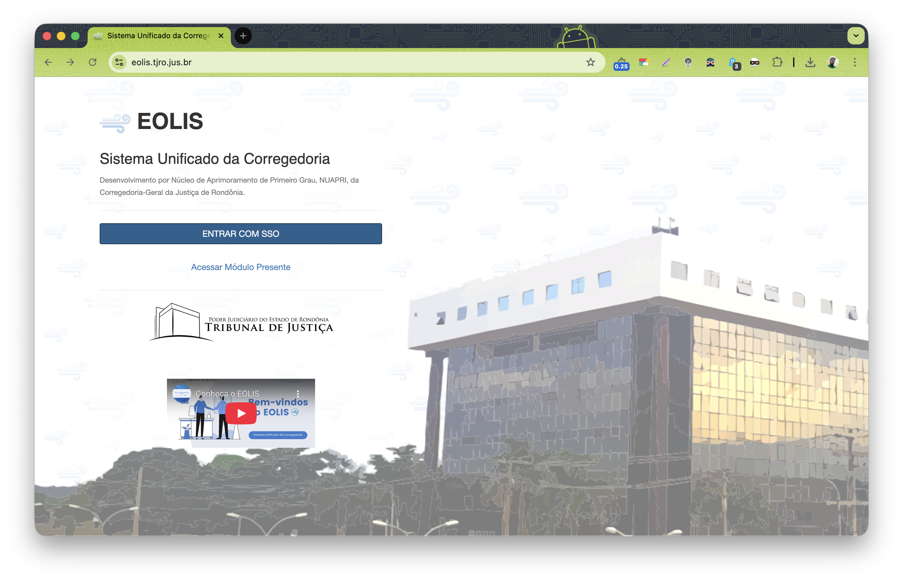

No recesso forense de 2017, eu e mais dois colegas (Maicon Cucchi e Jacob Nery) começamos um projeto com uma ambição simples: **parar de “caçar” informação em lugares diferentes** para conseguir enxergar o que estava acontecendo na Corregedoria-Geral do TJRO.

O nome que ficou foi **Eolis**.

## O que é o Eolis (em uma frase)

O Eolis é uma plataforma que **centraliza dados e indicadores** para apoiar gestão, transparência e decisões baseadas em dados na Corregedoria-Geral de Justiça do Estado de Rondônia.

Na prática: um lugar só para olhar metas, gargalos, produtividade e rotinas que antes eram planilhas, consultas avulsas e “BIRTs” espalhados.

## Por que ele nasceu

Naquele período, a sensação era a mesma em quase toda demanda:

- alguém pedia um número “pra ontem”;
- o dado existia, mas estava em sistemas diferentes;
- o esforço era sempre manual (e repetido).

O Eolis nasceu para virar esse jogo: **automatizar o básico** e deixar a equipe focar no que interessa — análise e ação.

## Linha do tempo (bem resumida)

- **2017**: início do projeto no recesso forense (primeiras telas e primeiras rotinas).
- **Ventos**: o ETL que alimenta o Eolis.
- **2020+**: transição do ETL para uma orquestração mais flexível com Apache Airflow.
- **2022+**: consolidação da aplicação com PostgreSQL (mantendo também um datamart em Oracle para análises específicas).

## O que ele entrega hoje

O Eolis foi crescendo por módulos, sempre puxado por dor real do dia a dia. Alguns exemplos:

- **Monitoramento de processos paralisados** (pra enxergar onde o fluxo travou).
- **Autocorreição** (autoavaliação e melhoria contínua).
- **Relatórios de promoção** (geração automatizada e mais objetiva).
- **Presente** (acompanhamento de frequência em penas/medidas alternativas).
- **Integrações** com SEEU/PJe em cenários específicos.
- **PRECALC** (cálculo de prescrição, quando aplicável).
- **Argus** (acompanhamento de metas do CNJ e critérios do Prêmio CNJ de Qualidade).

## Arquitetura, sem mistério

A stack foi escolhida mais por pragmatismo do que por “moda”:

- **Laravel** na camada de aplicação (MVC, produtividade e manutenção).
- **PostgreSQL** como base principal da aplicação.
- **ETL** (Ventos) orquestrando a entrada/atualização de dados.
- **Airflow** como evolução natural quando o pipeline começou a ficar mais complexo.

## O impacto (do meu ponto de vista)

O maior ganho não foi “um dashboard bonito”.

Foi reduzir atrito: menos retrabalho, menos corrida atrás de número, e mais tempo para responder perguntas do tipo:

- *qual é o gargalo agora?*
- *o que piorou no mês?*
- *qual unidade precisa de intervenção?*

Quando isso acontece, tecnologia vira gestão.

## Links

- Vídeo: https://www.youtube.com/watch?v=8CkHZ6OPJ3c
