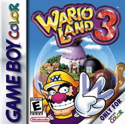

**Wario Land 3: Uma Jornada de Moedinhas e Memórias**

Quem jogou o Game Boy Color sabe como certos jogos ficam marcados na memória, e um dos meus maiores favoritos foi *Wario Land 3*. Não só pela jogabilidade, que combinava exploração e ação, mas por um desafio específico que se tornou uma obsessão para mim: pegar todas as moedas escondidas nas fases para acessar a fase secreta de golf. O problema? Havia uma fase que simplesmente não conseguia completar. Eu passei horas e mais horas tentando encontrar a oitava moeda que me faltava, acreditando que meu cartucho estava com algum bug.

Eu jogava tanto, que cheguei a duvidar da integridade do meu cartucho. Parecia que a moeda estava "quase lá", mas sempre ficava fora do meu alcance. A frustração era tanta que muitas vezes eu pensava em desistir, mas a ideia de um prêmio secreto me motivava a seguir em frente.

E então, anos depois, quando já havia deixado o jogo de lado, me deparei com um vídeo no YouTube. Era de um cara mostrando exatamente como pegar todas as moedas, usando um emulador. Ele estava fazendo exatamente o que eu não conseguira no meu Game Boy: completar aquela fase traiçoeira. Foi aí que eu percebi que meu cartucho não estava bugado. O problema era só a minha falta de habilidade e paciência naquela época. A sensação de saber que, sim, era possível, me fez sentir uma mistura de alívio e decepção ao mesmo tempo.

Agora, em 2025, a história deu uma reviravolta. Decidi que ia tentar de novo. Desta vez, com um Game Boy Color novinho e um cartucho de *Wario Land 3* legítimo. Não podia mais deixar essa conquista pendente. Em algum lugar, nas memórias dos meus antigos jogos, eu sabia que conseguiria completar aquele desafio. Hoje, com mais experiência e uma abordagem mais paciente, sinto que finalmente será a hora de pegar todas as moedinhas.

Mas a história não termina aí. Durante os anos que passei estudando a ferramenta Unity para desenvolvimento de jogos, acabei criando um projeto inspirado na primeira fase de *Wario Land 3*. A inspiração veio não só pela nostalgia do jogo, mas também pela complexidade e pelas mecânicas que ele oferecia. Confira o link abaixo para ver o que criei!

Não importa o tempo que levei ou o quão longe eu tenha ido, a busca pela última moeda se tornou uma história de perseverança e de amor por um dos maiores clássicos do Game Boy Color. E agora, com a minha versão "remasterizada" de *Wario Land 3* em mãos, posso finalmente terminar o que comecei muitos anos atrás. Vai valer a pena!

