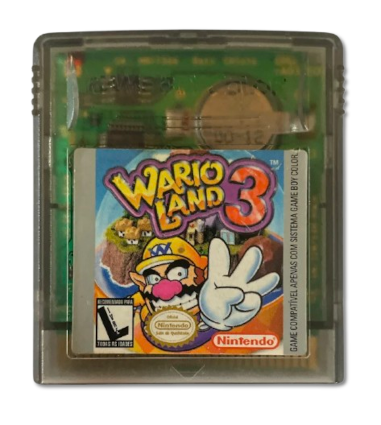
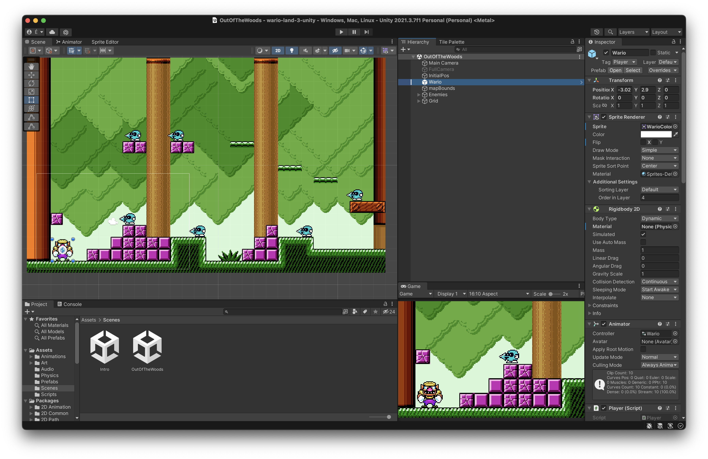

---
title: "Wario Land 3"
slug: 'wario-land-3'
date: 2025-07-13
draft: true
images: ["images/wario-land-3.png"]
thumbnail: "images/thumbnail/wario-land-3.png"
tags: ["wario", "game boy", "retro", "infancia", "nostalgia"]
---------------------------------------

Lá pelos idos de 2002, quando **“Misunderstood” do Robbie Williams** ainda tocava com frequência nas rádios no final da tarde — daquele tipo de música que embalava os comerciais de novela e os momentos ociosos de domingo — eu estava em outra sintonia: a do meu **Game Boy Color teal**, bem ali no meio da cama dos meus pais, jogando **Wario Land 3** sem parar. Literalmente. Só parava quando as pilhas acabavam.

E pilhas acabavam muito rápido.

Como qualquer criança que não ganhava um pacote de pilhas novo por semana, desenvolvi uma estratégia que se tornaria rotina: roubava as pilhas do controle remoto da TV da sala. Jogava no modo mudo — não por querer ser discreto, mas porque isso fazia as pilhas durarem um pouco mais. O som era luxo. O que importava era progredir. E o Wario, aquele anti-herói desengonçado com sua cara de poucos amigos, me conquistava com cada fase maluca, cada power-up estranho e cada segredo bem escondido.

Naquela época, entre uma jogatina de **Wario Land 3** e outra de **Pokémon Blue**, minha infância era uma aventura portátil. Mas Wario era diferente. Eu não estava apenas jogando — estava desvendando. Era como se cada fase tivesse vida própria, e mesmo as que eu revisitava tinham sempre algo novo, uma porta que só abria com uma habilidade específica, uma área que só ficava acessível depois de desbloquear outro estágio. Era uma progressão quase metroidvania, mas com cara de jogo infantil. Aquilo me viciava.

Mas teve **uma fase** — uma bendita fase — que ficou entalada.

Eu tinha coletado quase todas as moedas musicais (as **Music Coins**, uma em cada cor de baú), mas em **uma única fase** eu nunca consegui encontrar a última moeda. Não importava quantas vezes eu revisasse os cantos, experimentasse as transformações do Wario (zumbi, elástico, chamas), simplesmente não aparecia. E por causa dela, eu **nunca consegui liberar a fase bônus de minigolfe** — aquela que todo mundo comentava nas revistas ou nas rodas de colegas que também tinham o jogo. Era como um segredo que só os melhores conseguiam.

A frustração virou lenda pessoal. Mas ao invés de me afastar do personagem, isso me aproximou ainda mais. Por ter passado tanto tempo nesse mundo meio torto, colorido e cheio de personalidade, o **Wario acabou se tornando meu personagem favorito daquele universo Mario**. Muito mais que o próprio encanador vermelho, que sempre me pareceu previsível. Wario era caótico. Era engraçado. Era eu.

Anos se passaram.

Na era do 3DS, quando a Nintendo lançou o **Wario Land 3 na Virtual Console**, eu não pensei duas vezes. Comprei a versão digital e tentei reviver a experiência. Mas mesmo com tela iluminada, save states e conforto moderno, o desafio da moeda perdida persistiu. Era como se o jogo me dissesse: “Você cresceu, mas ainda não está pronto”.

E afim de aprender um pouco sobre a Unity 3D, uma engine para jogos,
criei um projeto inspirado na primeira fase do Wario Land 3.
Tem até uma versão “jogável” [aqui](https://hewerthomn.com/wario-land-3-unity/).

Recentemente, movido por saudade e por uma vontade de encerrar ciclos, comprei um **cartucho original usado** de Wario Land 3 num site retrô. Veio com cheiro de armário antigo e uma etiqueta meio desbotada. Ainda falta o console — um **Game Boy Color de verdade**, talvez teal de novo, talvez transparente como o que eu só via nas mãos dos colegas mais sortudos. Mas o cartucho está ali, parado na estante, me esperando com a mesma calma com que as fases esperavam serem exploradas. E talvez agora eu encontre a moeda.

Ou talvez não. Mas isso pouco importa.

Porque Wario Land 3, pra mim, não é mais só sobre completar fases. É sobre memórias, persistência, aquele sentimento de ter um mundo inteiro dentro de um cartucho de 2 polegadas. É sobre crescer e perceber que algumas moedas a gente passa a vida procurando — e tudo bem não encontrá-las. O que importa é o quanto a gente se diverte tentando.
